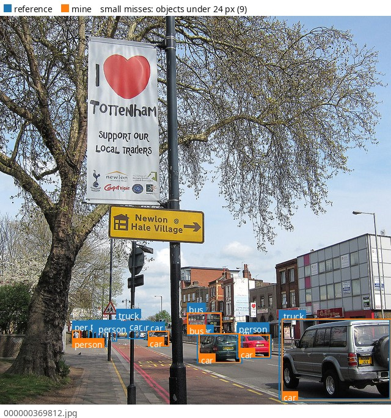
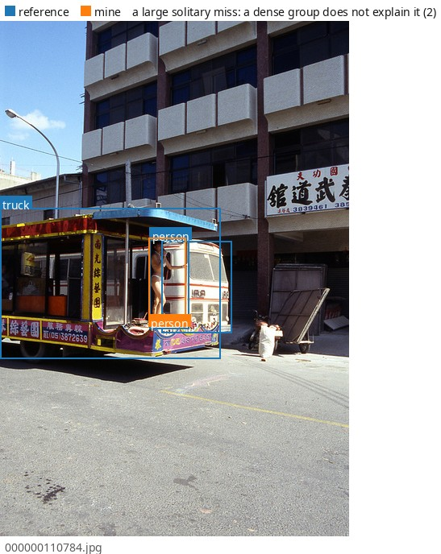
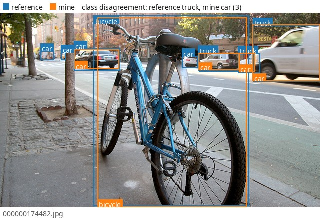
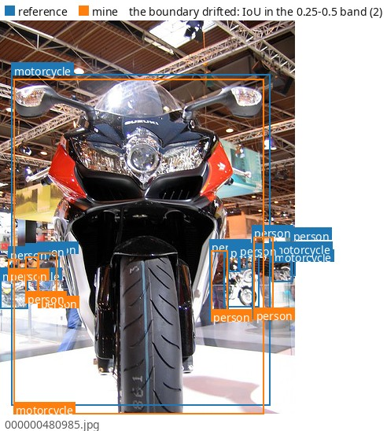
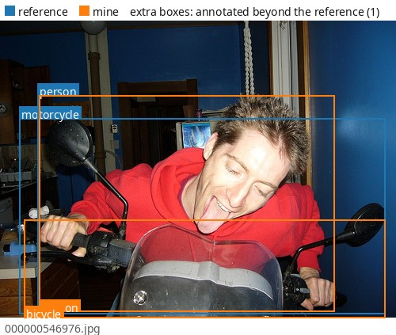
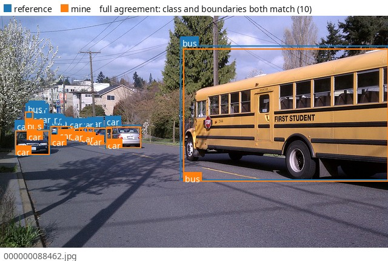

# detection-annotation-agreement

Annotation agreement on bounding boxes: 100 frames of COCO val2017 annotated by hand
across six classes (`person`, `car`, `truck`, `bus`, `bicycle`, `motorcycle`), blind to
the ground truth. Two things are measured separately: how precisely the boundaries are
drawn, and how far the choice of class agrees.
Stage P2 of an annotation-quality portfolio.

<!-- note:intro -->
> **What happened here:** the two metrics point in opposite directions, and both are
> right. What was found is outlined precisely and named correctly -- mean IoU 0.867,
> kappa 0.914 -- but only two thirds of what the reference annotates was found at all.
> The interesting part is the 32 misses that size cannot explain: reviewed by eye,
> two thirds of them turned out to be deliberate decisions under rules that the
> guidelines never stated. Those three rules -- carrier of the scene, fragment without
> identification, background -- are now section 4.5, and without them the guidelines
> described annotation other than the one that came out.
<!-- /note -->

## Result

| | |
|---|---|
| frames | 100 |
| boxes, mine / reference | 364 / 551 |
| pairs matched | 338 |
| **mean IoU over matched pairs** | **0.867** |
| **Cohen's kappa on the class** | **0.914** |
| `Mismatching label` | 21 |
| `Missing annotation` | 197 |
| `Extra annotation` | 10 |
| `Low overlap` | 16 |

The matching threshold is IoU 0.5 and matching is **class-agnostic**: require the labels
to agree and a class error splits into a miss plus an extra box on the spot, leaving
nothing to compute kappa on. Kappa therefore stands over the 338 matched pairs and answers
"how far do I agree on the class once the object has been found"; the misses are what
`Missing annotation` measures, and they are the larger number here.

## Where the misses come from

Median shorter box side: 62.6 px among matched objects against 16.3 px among missed ones.
69% of the 197 misses fall on objects under 24 px. The guidelines declared a 5 px threshold
while practice sat at 20-25 px, so the threshold was raised to 20 px to match the fact --
and missing the small stuff became declared policy rather than an accident.



That leaves 32 misses with a shorter side of 48 px or more, which the threshold cannot
account for. 8 of them sit inside a dense group; the other 24 are solitary and were
reviewed frame by frame:

| | cases | classes |
|---|---|---|
| chose not to annotate | 16 | `bus` 5, `truck` 4, `motorcycle` 3, `bicycle` 2, `person` 1, `car` 1 |
| did not notice | 8 | `person` 4, `bicycle` 2, `bus` 2 |



The food van above is `truck` to the reference and background to me. A rule fixes the
first kind of miss; only a change of technique -- a second pass over the frame for
`person` alone -- fixes the second.

## A disagreement over class policy

Of the 30 matched reference `truck` objects I called 10 `truck`, 18 `car` and 2 `bus`.
That is not scatter: my guidelines divide `car` from `truck` by what the body is for,
while the COCO convention goes rather by size and chassis, and pickups, minivans and
glazed vans fall inside it. A reproducible, explicable disagreement of this kind is cured
by agreeing the convention before the work starts, never by re-annotating afterwards.

| Reference \ Mine | person | car | truck | bus | bicycle | motorcycle | missed | mean IoU |
|---|---|---|---|---|---|---|---|---|
| person | **145** | -- | -- | -- | -- | -- | 92 | 0.841 |
| car | -- | **78** | -- | -- | -- | -- | 54 | 0.877 |
| truck | -- | 18 | **10** | 2 | -- | -- | 12 | 0.886 |
| bus | -- | -- | 1 | **32** | -- | -- | 9 | 0.917 |
| bicycle | -- | -- | -- | -- | **21** | -- | 16 | 0.868 |
| motorcycle | -- | -- | -- | -- | -- | **31** | 14 | 0.886 |



## The worst frames

Every picture carries its own legend: a blue swatch for the reference, an orange one for mine, the numbers of the case beside them and the frame name underneath.
Frames are picked automatically: for each kind
of disagreement, the one holding the most cases of it.

### The boundary drifted

`Low overlap` is a same-class pair with IoU in [0.25, 0.5) -- the object was found and the
boundary is loose. 16 cases over 354 pairs, most of them `person` (7) and `bicycle` (5):
both give a complex silhouette and the difference accumulates on limbs and spokes.



### An extra box



### Full agreement, for contrast

Ten objects matching on both class and boundary. This is what a frame looks like when no
convention is touched.



## Reproduce

Python 3.10+ and Pillow; Pillow is needed only for the figures, all metrics run on the
standard library.

```bash
python3 -m venv .venv && .venv/bin/pip install -r requirements.txt

# integrity of the annotation before anything is computed from it
.venv/bin/python annotation/validate.py \
    --coco annotation/my_labels/coco/instances_default.json --min-side 20

# the format converter, round-tripped against known answers
.venv/bin/python annotation/convert.py \
    --selftest --input annotation/my_labels/coco/instances_default.json

# the numbers in this README
# instances_val2017.json comes from
# http://images.cocodataset.org/annotations/annotations_trainval2017.zip
.venv/bin/python annotation/agreement.py \
    --mine annotation/my_labels/coco/instances_default.json \
    --reference data/coco/annotation/instances_val2017.json \
    --out reports/agreement_metrics.json

# the pictures above; needs the frames themselves
# http://images.cocodataset.org/zips/val2017.zip
.venv/bin/python annotation/make_figures.py \
    --mine annotation/my_labels/coco/instances_default.json \
    --reference data/coco/annotation/instances_val2017.json \
    --frames data/subset/frames --out reports/figures
```

My annotation is committed in both COCO and YOLO form, so every number reproduces from the
reference JSON alone. The 100 frames are not committed -- the subset is rebuilt from
`data/subset/selection.json` and is needed only to redraw the figures.

## What else is here

- Annotation guidelines, the acceptance protocol and the disputed-case decisions -- [annotation/GUIDELINES.md](annotation/GUIDELINES.md)
- Full report -- [reports/agreement_report.md](reports/agreement_report.md)
- Format converter COCO / YOLO / VOC with a round-trip self-test -- [annotation/convert.py](annotation/convert.py)

## The other stages of this portfolio

| stage | type | headline numbers |
|---|---|---|
| P2 | boxes -- **this repository** | kappa 0.914, mean IoU 0.867 |
| A2 | [polygons and masks](https://github.com/daviddolya/polygon-annotation-agreement) | mask IoU 0.840, Boundary IoU 0.676 |
| A3 | [tracks on video](https://github.com/daviddolya/tracking-annotation-agreement) | IDF1 0.896, 2 ID switches |
| A4 | [skeletons](https://github.com/daviddolya/keypoint-annotation-agreement) | OKS 0.895, flag agreement 0.822 |
| A5 | [scene text](https://github.com/daviddolya/ocr-annotation-agreement) | mask IoU 0.784, CER 0.223 |
